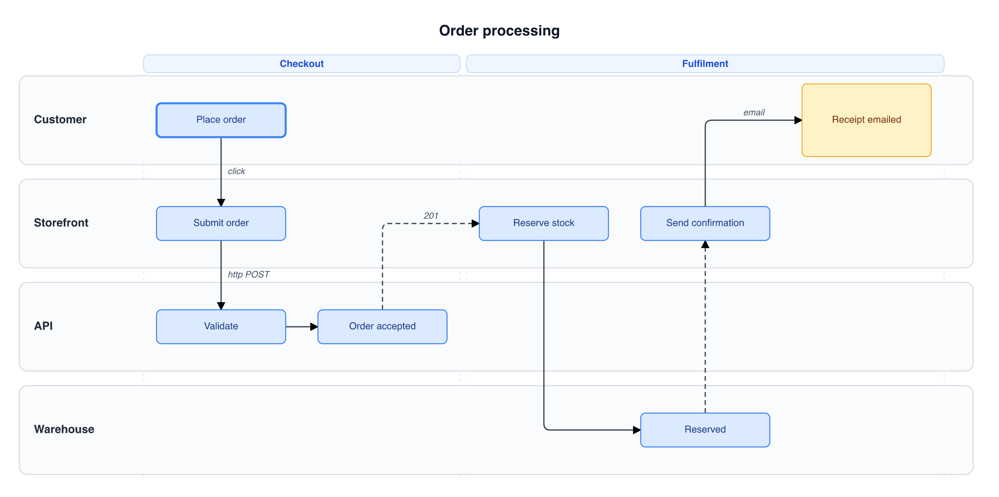

# Swimlane Studio

A single-file SPA that renders swimlane diagrams from a concise, line-oriented
DSL. Boxes live in their sender's lane, arrows are routed deterministically
by a layout solver, and the whole diagram exports to SVG or PNG. The diagram
can be flipped between horizontal swimlanes (lanes stacked top-to-bottom,
time flowing left-to-right) and vertical swimlanes (lanes side-by-side
left-to-right, time flowing top-to-bottom).



## Quick start (web app)

Clone the repo and serve the folder with any static file server — the web
app has **no build step and no external libraries**:

```sh
git clone https://github.com/markhammond-covecta/swimlane-studio.git
cd swimlane-studio
python3 -m http.server 8765
open http://localhost:8765/index.html
```

That's it. `index.html` loads
the diagram engine from `lib/swimlane-core.js` (a plain ES module, also
served by the same static server), so both files must sit together. The
page polls the `Last-Modified` header of `index.html` **and**
`lib/swimlane-core.js` every ~1.5s and reloads itself when either
changes on disk, so editing in another tool gives you a live preview.
The editor content, split-pane position, zoom level, and orientation
choice all survive reloads via `localStorage`.

### Standalone single file (no server)

Browsers won't `import` the engine module over `file://`, so opening
`index.html` directly from disk doesn't work. Run the build to inline the
engine into one self-contained file you can open straight from Finder/Explorer
(double-click — no server):

```sh
node build.mjs                 # writes swimlane-studio.html
node build.mjs my-diagram.html # or choose the output name
```

The output embeds `lib/swimlane-core.js` as an inline module, so there are no
external requests. Re-run it after editing `index.html` or the engine.

## Syntax

The DSL is line-oriented. Click the
**Help** button in the header for a quick in-app reference.

| Form | Meaning |
| --- | --- |
| `title: Order processing` | Diagram title (centred above the lanes). |
| `order: Customer, Storefront, API` | Force the lane order (top-to-bottom in horizontal, left-to-right in vertical). Otherwise lanes appear in the order they're first used. |
| `Alice -> Bob: Send order` | Cross-lane message. Box "Send order" in Alice's lane, arrow down/across to Bob. |
| `Alice --> Bob: ACK` | Same, but with a dashed line (typically a response). |
| `Alice -> Alice: Validate` | Same-lane forward link. Box in Alice with a horizontal trail to the next Alice-source box. |
| `Alice <-> Alice: Process` | Bidirectional same-lane: forward link plus a backward link from the previous Alice-source box. |
| `Alice <-> Bob: Sync call` | Bidirectional cross-lane: the normal cross-lane arrow plus a same-lane backward link from the previous Alice box. |
| `Bob >-> Alice: Reply` | Counter-pair forward link. After `Alice -> Bob`, this opts INTO the shared-column side-by-side rendering (down-and-up arrows next to each other). Without `>->`, the reply breaks the chain and starts a new column. |
| `Alice <: Done` | Backward-only box: incoming link from the previous Alice box, no outgoing trail. Useful for terminal states. |
| `Alice: Read output` | Standalone (non-directed) box — no arrows of its own; receives any cross-lane arrow targeting Alice at the same column. |
| `[1] Alice -> Bob: Start` | Tag the box this line creates as `1`. The tag is never drawn; it just gives a later statement something to loop back to. Any tag name works (`[1]`, `[retry]`, …). |
| `Carol -> [1]: Retry` | Loop back to the box tagged `1`: draws a `Retry` box in Carol's lane with a backward arc to the tagged box. See [Loop-backs](#loop-backs). |
| `[ Section name ]` | Labelled section banner spanning the columns that follow. |
| `note Alice: Inspect logs` | Yellow note attached to a single lane. |
| `note Alice, Bob: Drift window\n2s` | Multi-lane note (uses `\n` for line breaks). |
| `# …` or `// …` | Comment line. |

### Arrow labels

Any message text ending in `<…>` puts the bracketed text on the arrow
itself as an italic caption, separately from the box label.

```
Browser -> Server: Send request <synchronous call>
```

renders a "Send request" box with "synchronous call" beside the arrow.

### Loop-backs

To show control returning to an earlier step, tag the target box with a
leading `[tag] ` and then point a later statement at `[tag]`:

```
[1] First -> Second: Apple
Second -> Third: Orange
Third -> [1]: Lemon
```

The `Lemon` box sits in the `Third` lane (like any other message) and a
backward arc is drawn from it to the `Apple` box tagged `1`. The tag
itself is never displayed.

- Tag names are free-form (`[1]`, `[retry]`, `[step 2]`, …) and may be
  referenced before or after they are defined.
- The arc routes through a reserved channel above the lanes (to the side
  in vertical orientation) and **never crosses a box**.
- Where the arc crosses another connector it breaks, so it reads as
  passing underneath. In ASCII the break is a gap in the arc; in SVG the
  crossing connector carries a thin white casing.
- Multiple loop-backs nest automatically — wider arcs sit further out.
- An undefined tag is reported as an error and the loop-back is dropped.

### Wrapping

- Box captions wrap at ~22 chars per line; overlong single tokens are
  chopped so they can't overflow.
- Arrow captions wrap at ~22 chars per line (horizontal) or ~14
  (vertical), and the solver widens the inter-column gap automatically
  so even long captions don't crash into the next box.
- Lane names wrap to fit the lane width in vertical mode.

## Orientation

Toggle between **horizontal** (↔) and **vertical** (↕) layouts using
the segmented control in the diagram pane header. The choice persists
across reloads.

- **Horizontal**: lanes stack top-to-bottom; time flows left-to-right.
- **Vertical**: lanes sit side-by-side left-to-right (first-declared
  lane on the left); time flows top-to-bottom. Lane captions sit in a
  compact strip above each column with wrapping; boxes stay landscape
  for readable labels; rows are spaced just like adjacent columns in
  horizontal mode.

## Layout rules

The solver is deterministic and enforces:

1. **Arrows are vertical or strictly left-to-right.** No right-to-left
   horizontal segments. (Vertical orientation transposes the diagram,
   so these axes flip in the final SVG but the logical solver runs in
   the horizontal frame.)
2. **Arrows never enter a box on the right or exit on the left.**
3. **Arrows are either:** a straight segment, an L-shape (2 segments),
   or a Z-shape (3 segments) when entering from the left.
4. **Shortest path subject to the rules.** Ties prefer fewer bends and
   the earliest valid column.
5. **Boxes default to vertical alignment with their source.** A target
   box sits in the same column as the source unless that column/lane
   is already occupied, an intermediate-lane box would block the
   vertical, or an existing arrow at that column would overlap. In any
   of those cases the box moves right by one column.
6. **Counter-back chains break by default.** When `A -> B` is followed
   by `B -> A`, the reply starts a NEW column rather than routing back
   to A's originating box. Use `B >-> A: ...` to opt into the legacy
   shared-column counter-pair rendering (down-arrow and up-arrow
   offset by ±10 px at the same column).
7. **Variable column widths.** A column is extended automatically when
   a same-lane horizontal caption is wider than the default 40 px gap;
   long lane names extend the caption strip the same way.
8. **First box is bolded.** The first activity box in the diagram
   renders with a thicker (2.5 px vs 1.25 px) blue border to mark the
   entry point.
9. **Elbow corners are rounded** (8 px quadratic curves).

## Zoom

The diagram pane header has zoom controls:

- **−** / **+** snap to 25 % increments (25 %–400 %).
- **Fit** — exact ratio that fits the whole diagram in the viewport.
- **Reset** — 100 %.
- **Ctrl/Cmd + wheel** or **two-finger trackpad pinch** zoom around
  the cursor, anchoring the point under the gesture in place.

Zoom level persists across reloads.

## Source: New / Load / Save

The source pane has a button row:

- **New** — clear the editor (prompts if there are unsaved changes).
- **Load** — open a `.txt` file (prompts if there are unsaved changes).
- **Save** — write the editor contents to a `.txt` file. Uses
  `showSaveFilePicker` when available, falls back to a download.

"Unsaved" is measured against the last explicit Save or Load (the
baseline is persisted to `localStorage`, so the warning survives a
tab close). A browser `beforeunload` prompt fires if you try to close
the tab with unsaved edits.

## Export

- **Download SVG** / **Copy SVG** — raw vector source.
- **Download PNG** / **Copy PNG** — rendered at 2× scale onto a white
  canvas.
- **Copy source** — copies the editor's DSL to the clipboard.

`Copy PNG` requires HTTPS or localhost (it uses the asynchronous
`ClipboardItem` API).

## Keyboard / mouse

- Drag the central divider to resize the source and diagram panes; the
  position persists. Arrow keys nudge it by 20 px. Double-click resets
  the default split.
- The diagram pane scrolls independently; large diagrams scroll
  horizontally and vertically.
- **Esc** closes the Help modal.

## MCP server

`server/` is a local [Model Context Protocol](https://modelcontextprotocol.io)
server that renders diagrams from the same DSL, reusing the exact
`parse → solveLayout → render` pipeline from `lib/swimlane-core.js`. It
runs over **stdio** — the MCP client spawns `node server.js` on demand and
talks to it over stdin/stdout; nothing listens on a network socket and
nothing is left running.

### Install

Requires **Node.js 18+**. From a clone of the repo:

```sh
cd swimlane-studio/server
npm install            # @modelcontextprotocol/sdk, @resvg/resvg-js, zod, esbuild
npm run smoke          # spawns the server and exercises every tool (optional check)
```

No global install and nothing to keep running — the MCP client spawns
`node server.js` on demand.

### Register with Claude Code

```sh
claude mcp add swimlane -- node /absolute/path/to/swimlane-studio/server/server.js
```

### Register with Claude Desktop / other MCP clients

Add an entry to the client's MCP config (for Claude Desktop, this is
`claude_desktop_config.json`):

```json
{
  "mcpServers": {
    "swimlane": {
      "command": "node",
      "args": ["/absolute/path/to/swimlane-studio/server/server.js"]
    }
  }
}
```

Restart the client and the three tools below become available.

### Inline interactive viewer (MCP App hosts)

In hosts that support MCP Apps (e.g. Claude Desktop), `render_swimlane`
also draws the diagram inline as an interactive SVG. That viewer is built
into a single self-contained `dist/app.html` and is regenerated with:

```sh
npm run build:app      # bundles app/ into dist/app.html via esbuild
```

A prebuilt `dist/app.html` is committed, so this is only needed after
editing the viewer source under `server/app/`.

### Tools

| Tool | Input | Output |
| --- | --- | --- |
| `render_swimlane` | `source`, `orientation?` (`horizontal`/`vertical`), `format?` (`svg`/`png`/`ascii`/`all`), `scale?`, `save_path?` | SVG text, a PNG image, ASCII art, or all three; optionally written to disk. |
| `validate_swimlane` | `source` | Detected lanes (in order), message/note/section counts, and parse errors — a cheap syntax check before rendering. |
| `swimlane_syntax` | — | The DSL cheat-sheet. |

PNG is rasterised from the SVG with `@resvg/resvg-js`. ASCII art is a
separate fixed-grid renderer (`renderAscii`) that draws box-drawing
characters off the logical lane/column model, so connectors align exactly;
ASCII output is always laid out horizontally.

The server also advertises a compact syntax primer in its MCP
`instructions`, so MCP clients without skill support can still author valid
diagrams.

## Skill

`.claude/skills/swimlane/` wraps the server for Claude Code. The skill
carries the full DSL reference and worked examples and triggers on requests
to draw/generate/export a swimlane or sequence diagram, then drives the
`mcp__swimlane__*` tools. The split is deliberate: the **skill** is the
knowledge + workflow layer for Claude Code, while the **server** is the
self-contained rendering capability for any MCP client.

## Project layout

| Path | Responsibility |
| --- | --- |
| `lib/swimlane-core.js` | The framework-free, DOM-optional diagram engine shared by the web app and the MCP server. Exports `parse`, `solveLayout`, `render`, `renderAscii`, `wrap`, and friends. `measureTextPx` falls back to a font-size-aware estimate when no canvas is available (i.e. under Node). |
| `index.html` | The single-page app: `<style>` theme/panes/toggles/help modal, plus the driver that imports the engine and hooks it to the editor, hot-reload, persistence, zoom, orientation, New/Load/Save, and exports. |
| `server/server.js` | The stdio MCP server (`render_swimlane`, `validate_swimlane`, `swimlane_syntax`). |
| `server/smoke.js` | End-to-end smoke test that spawns the server over stdio and calls every tool. |
| `.claude/skills/swimlane/` | The Claude Code skill wrapping the server. |

Inside `lib/swimlane-core.js`:

| Function | Responsibility |
| --- | --- |
| `parse(source)` | Tokenises the DSL into events + lane order + sections. |
| `solveLayout(model)` | Phase 1 places boxes (chained columns, counter-back break, move-right rules). Phase 1.5 computes per-column right margins for long horizontal captions and builds `colCenters`. Phase 2 computes each arrow as a polyline using stored box dimensions (which swap in vertical orientation so the rendered boxes stay landscape). |
| `render(model)` | Emits the SVG. In vertical mode it wraps the content in a transposition group and counter-transposes text via `matrix(0 1 1 0 …)` so labels stay readable. Includes `polylineToPath` for rounded elbows and `arrowLabelSvg` for arrow captions. |
| `renderAscii(model)` | Emits a fixed-grid ASCII rendering, tracking line cells as Up/Down/Left/Right bitmasks so box and arrow junctions resolve to the correct box-drawing glyph. |

## License

[MIT](LICENSE).
